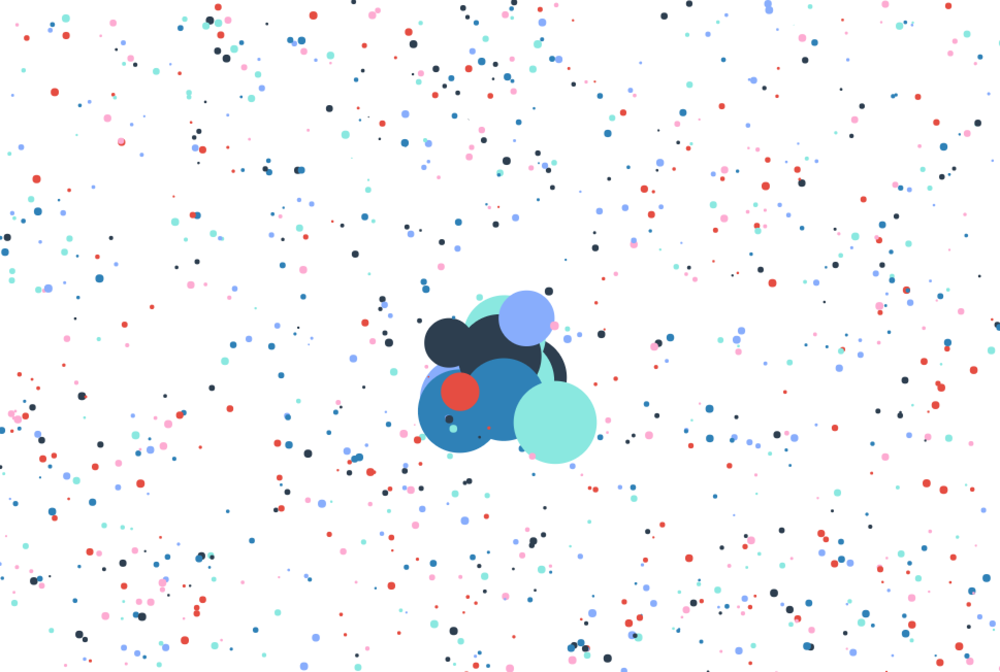

## Check the canvas-circle-motion project

https://robydoidao2006.github.io/canvas-circle-motion/.

## What the Project looks like

## Aditional Information
- This project is using a html5 tag called "canvas", The projects will display a set amount of animated circles, that bounces 
back and forth when hits the end of the window, and when the circle its hover by mouse at a radius of 50 pixels, the circle will grow, when the user stops hovering the circles, they will shink to original size. Please, keep in mind, the lager(more pixels) the screen you are viewing this project on, the less dense it will apear.

## This project was built using the floowing technologies 
- html5
- Javascript
- Deploy on github

## How to Run this Project Localy
- Clone / Download the repository.
- Unzip the file.
- Drag and drop the unzip folder on a text editor of your choice.
- On the html file, right click and click on "opem in default browser"

## Future Improvements
- create some sort of algorithm that will generate and x amounth of circles depending of the size of the window.
- add some music.

